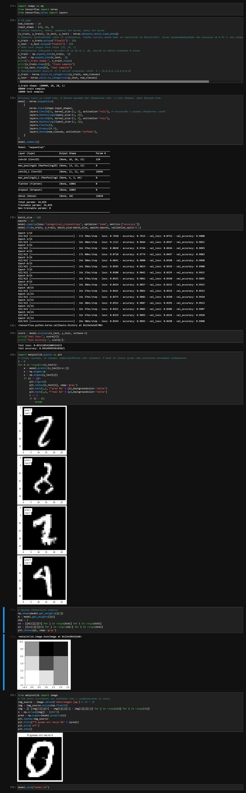

# flask-neuro
Классификация изображений с цифрами от 0 до 9

set FLASK_APP=app.py \
set FLASK_ENV=development \
python -m flask \
flask run 

Была создана сеть, способная различать стандартное чб изображение. Сеть была сохранена в файле model.h5.

Далее был создан маленький сервен на flask. Его задача - принять файл пользователя, прогнать его в нейронке и выдать результат.
